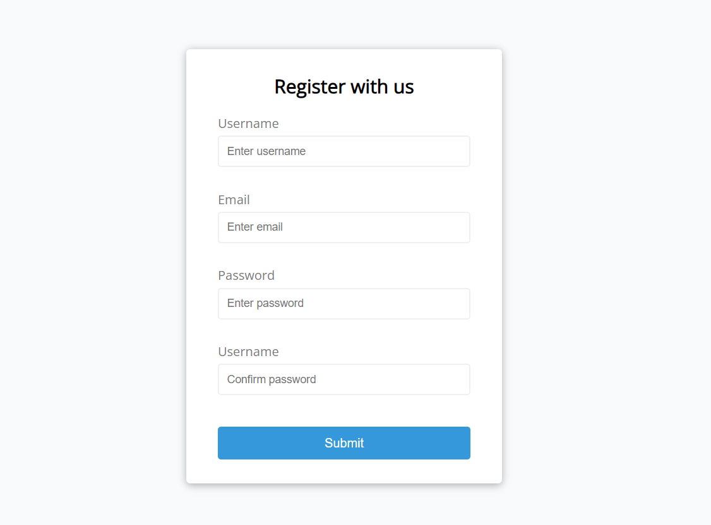
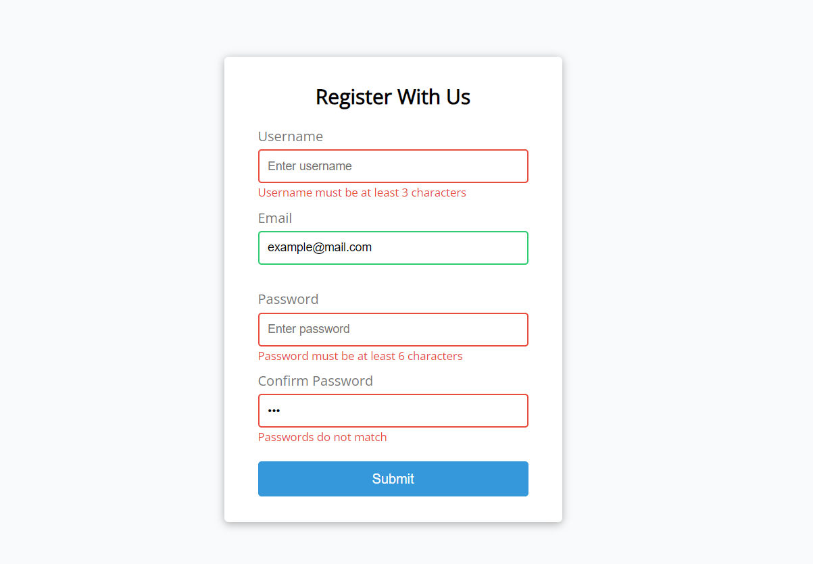

# Teeny Tiny Web Projects

This is the main repository for all of the projects written with mainly javascript.

## Form Validator

Form validation with error messages, mail and password validations etc...

### Project Specifications

- Create form UI
- Show error messages under specific inputs
- checkRequired() to accept array of inputs
- checkLength() to check min and max length
- checkEmail() to validate email with regex
- checkPasswordsMatch() to match confirm password

### Screenshots

