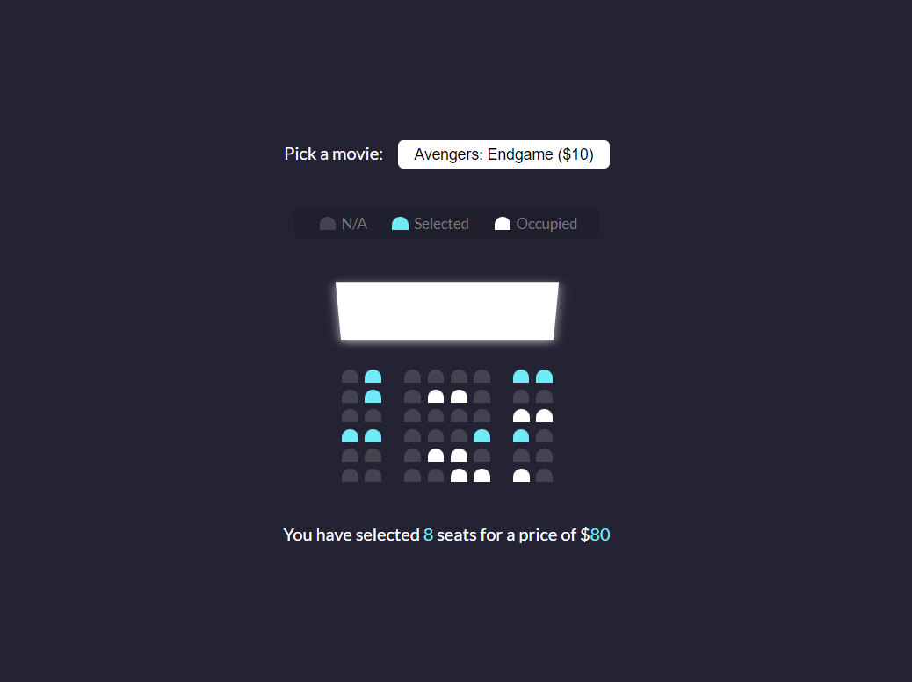

# Teeny Tiny Web Projects

This is the main repository for all of the projects written with mainly javascript.

## Movie Seat Booking

Display movie choices and seats in a theater to select from in order to purchase tickets.

### Project Specifications

- Display UI with movie select, screen, seats, legend & seat info
- User can select a movie/price
- User can select/deselect seats
- User can not select occupied seats
- Number of seats and price will update
- Save seats, movie and price to local storage so that UI is still populated on refresh

### Screenshots

### Authors

- [@barisgunduz](https://www.github.com/barisgunduz)

## Other Projects

|  #  |            Project             | Live Demo |
| :-: | :----------------------------: | :-------: |
| 01  |       [Form Validator](/form-validator)       | [Coming Soon...](#)  |
| 02  |       [Movie Seat Booking](/movie-seat-booking)       | [Coming Soon...](#)  |
